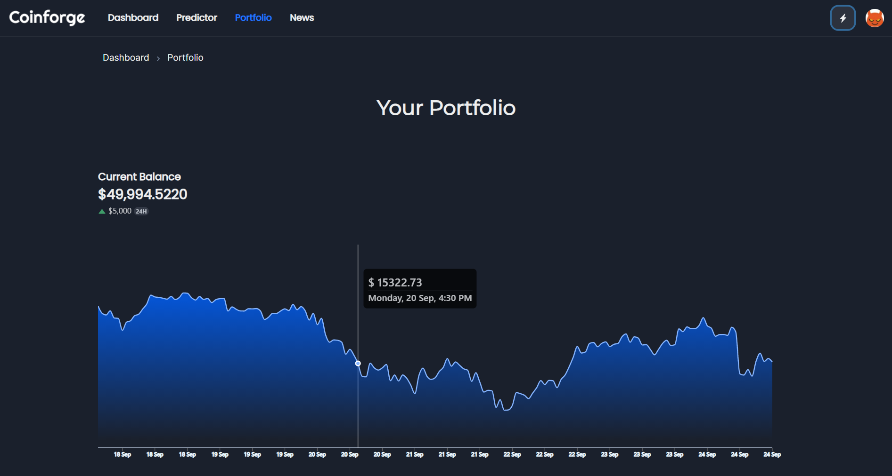
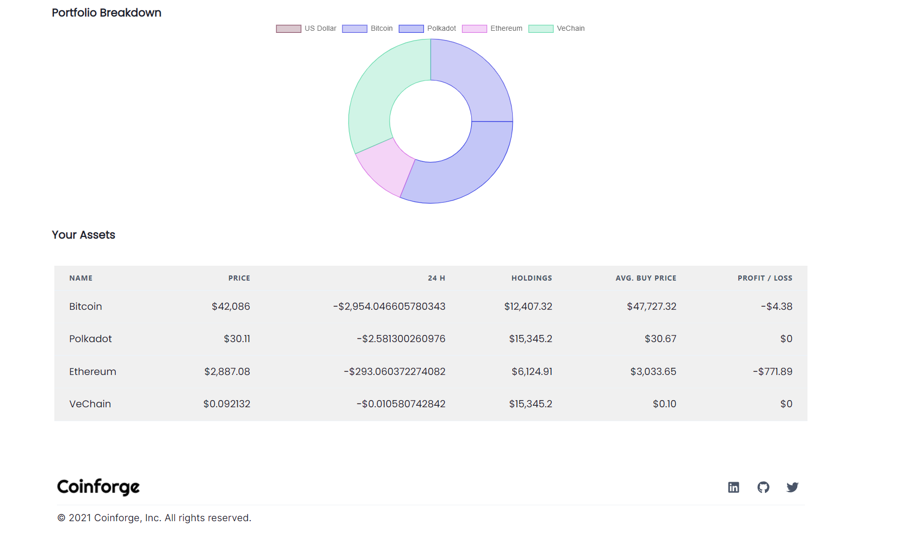

[](https://postimg.cc/2VrL1Yp0)

[coinfoge.com]()

# About

Coinforge is a mock cryptocurrency trading web app aiming to help begginers to gain trading experience before diving into deep waters.

## Technologies Used
* React js
* Express js
* Mongo DB
* Recharts / Visx (D3)

## Architecture

The architecture of this application is based on a typical MVC model.

1. The Client tier (View) is written in Javascript, HTML, and CSS, using ReactJS as the framework.
2. The Business Logic Tier (Controller) is written using NodeJs and ExpressJS. 
3. The Database Tier (Model) is hosted on MongoDB.<br>

<br>


Architectural pattern for a simple three-tier application.
_Picture from [aws docs](https://docs.aws.amazon.com/whitepapers/latest/serverless-multi-tier-architectures-api-gateway-lambda/three-tier-architecture-overview.html)_

<br>

# Preview

Dashboard


Crypto


News


Portfolio





# Installing

1. clone this repository

```
git clone https://github.com/aadityamayankar/Coinforge.git
```

2. cd into `Coinforge`

```
cd Coinforge
```

3. Install package dependencies

```
npm install
```

4. cd into backend

```
cd backend
```

5. cd up one directory

```
cd ..
```

4. Run the script below to serve front and back end concurrently

```
npm run dev
```